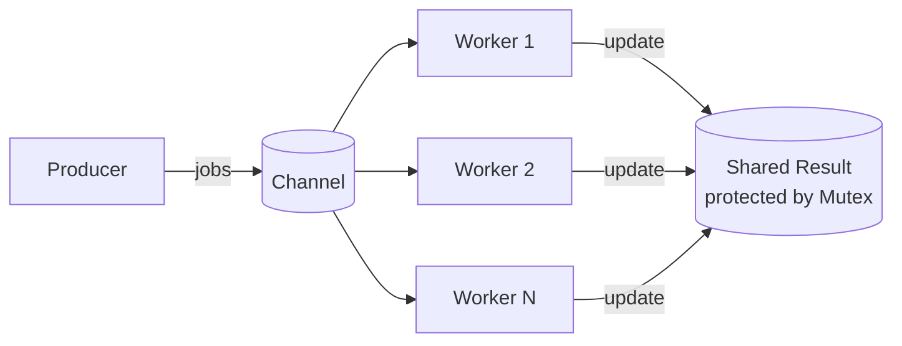

# Channel + Mutexes in Go

A simple Go concurrency example demonstrating how to coordinate goroutines using channels and protect shared state using a mutex, following a clean project layout (cmd/ + internal/).

🎯 What this project demonstrates

    ✔ Goroutines
    ✔ Channels (unbuffered)
    ✔ WaitGroups
    ✔ Mutex for shared state
    ✔ Worker pool pattern
    ✔ Concurrency synchronization
    ✔ Proper Go project structure

📦 Project Structure
```
.
├── cmd/
│   └── app/
│       └── main.go
└── internal/
    ├── worker/
    │   └── worker.go
    └── result/
        └── result.go
```

🧠 Concept

Multiple workers run concurrently, reading jobs from a shared channel.
Each worker processes incoming jobs, and updates a shared result structure using a mutex to safely increment a counter.

- This example demonstrates how to:
- distribute work between goroutines
- synchronize job processing using channels
- avoid race conditions using a mutex

🔁 How It Works
### 1. Main goroutine

- creates a channel
- starts worker goroutines
- sends jobs into the channel
- closes the channel
- waits for workers to finish

### 2. Workers

- receive jobs from channel
- simulate processing
- increment shared result using mutex
- exit when channel is closed


### 🏗 Architecture Diagram


### 🔒 Why Mutex?

Because multiple workers modify the same shared variable.
Mutex prevents multiple goroutines from updating at the same time → avoids race conditions.

### 🔗 Why Channels?

Channels synchronize sending and receiving.
Workers block until jobs arrive.
Main blocks until workers receive.

Channels are perfect for:

job queues

worker pools

pipelines

🚀 How to Run
```
go mod tidy
go run ./cmd/
```

🧪 Example Output
```
Sending job 0
Sending job 1
Sending job 2
Sending job 3
Sending job 4
Sending job 5
Sending job 6
Sending job 7
Sending job 8
Sending job 9
Final Results: 10
```
📘 What you learn

- how goroutines communicate using channels
- how mutex avoids data races
- why workers compete for jobs
- how results become non-deterministic
- how worker pool concurrency works
This is a classic worker-pool pattern in Go.

🧠 Key Takeaways

    ✔ Channels synchronize work
    ✔ Mutex protects shared memory
    ✔ Goroutines process jobs concurrently
    ✔ Ordering is non-deterministic
    ✔ Worker pools scale elegantly

✨ Next Ideas

Try extending this:

- use buffered channels
- measure performance
- add context cancellation
- add timeouts with select{}
- trace jobs using OpenTelemetry
- build a real worker pool library
- add metrics

🧐 Who is this for?

- Go beginners practicing concurrency
- Interview preparation
- Engineers learning worker pool patterns
- Anyone trying to understand channels + mutex
